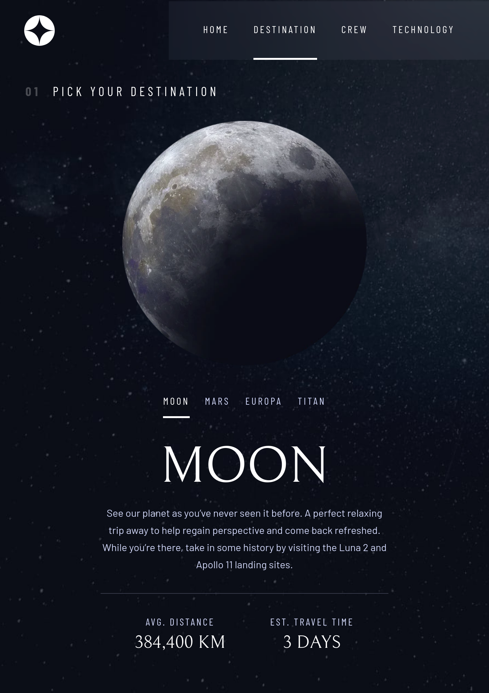

# Space tourism website
This is a solution to the [Space tourism website challenge on Frontend Mentor](https://www.frontendmentor.io/challenges/space-tourism-multipage-website-gRWj1URZ3) which was created in collaboration with the [Scrimba](https://scrimba.com/) platform.

## Table of contents

- [Overview](#overview)
  - [The challenge](#the-challenge)
  - [Screenshots](#screenshots)
  - [Links](#links)
- [My process](#my-process)
  - [Built with](#built-with)
  - [What I learned](#what-i-learned)
  - [Continued development](#continued-development)
  - [Useful resources](#useful-resources)
- [Author](#author)

## Overview

### The challenge

Users should be able to:

- View the optimal layout for each of the website's pages depending on their device's screen size
- See hover states for all interactive elements on the page
- View each page and be able to toggle between the tabs to see new information

### Screenshots
##### MOBILE
   

##### TABLET
  

##### DESKTOP

### Links

[Live demo](https://fmok-space-tourism-website.netlify.app/)

## My process
### Built with

- Mobile-first workflow
- CSS custom properties and utility classes
- CSS Grid, Flexbox
- VanillaJS

### What I learned

:arrow_right: In this project I learned a lot of things. I had an opportunity to learn new aria-attributes, how to build 'Skip to content' button, `@supports` feature.
:arrow_right: The hardest part was to combine all of the utility classes and not to break the things. The positioning was also challenging. 

### Continued development

:fast_forward: I think that this project can be improved by
  - using json file for updating the content instead of swapping the `hidden` attribute of the articles
  - fixing numbers right next to the text in primary navigation tabs (currently it is located above text)
  - `picture` elements that contain article images can be used for 'art direction' problem if the design specs change and we have to update images based on the orientation of the device

  ### Useful resources 
  - [Modern CSS Reset](https://piccalil.li/blog/a-modern-css-reset/)
  - [white-space:nowrap](https://stackoverflow.com/questions/15411260/nbsp-vs-white-spacenowrap/65334876#65334876)
  - [Utility classes](https://blog.logrocket.com/css-utility-classes-library-extendable-styles/)
  - [Stacking context](https://developer.mozilla.org/en-US/docs/Web/CSS/CSS_Positioning/Understanding_z_index/The_stacking_context)
  - [CSS Feature @supports](https://developer.mozilla.org/en-US/docs/Web/CSS/@supports)
  - [Media queries: Relative units](https://medium.com/@barrypeng6/why-should-not-use-rem-unit-in-media-query-5645d0163ce5)
  - [Skip to main content](https://accessibility.oit.ncsu.edu/it-accessibility-at-nc-state/developers/accessibility-handbook/mouse-and-keyboard-events/skip-to-main-content/)
  - [W3C: Navigation technique](https://www.w3.org/TR/WCAG20-TECHS/G1.html)
  - [Hidden attribute](https://css-tricks.com/the-hidden-attribute-is-visibly-weak/)
  - [Responsive images](https://webdesign.tutsplus.com/tutorials/quick-tip-how-to-use-html5-picture-for-responsive-images--cms-21015)

  ## Author

Frontend Mentor Profile - [@olesiakissa](https://www.frontendmentor.io/profile/olesiakissa)